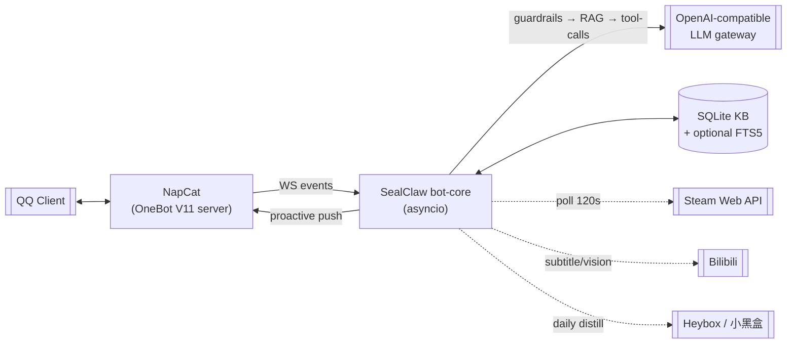

# SealClaw · QQ / OneBot11 Intel-Bot

> **An async QQ bot (OneBot V11) that fuses RAG-lite, Steam/Bilibili/Heybox sensors, and tool-calling LLM — P0→P6 feature cadence, fully offline-testable.**
>
> 基于 OneBot V11 反向 WebSocket 的 QQ 机器人。原生 asyncio，RAG-lite + 工具调用 LLM，自动感知 Steam/B 站/小黑盒，P0→P6 分阶段交付，测试可离线跑。

[English](#english) · [中文](#中文)


---

<a id="english"></a>

## TL;DR

SealClaw is a single-process, OneBot-V11 QQ bot built around a reverse-WebSocket event loop. Group chats pass through a guardrail → RAG-lite retrieval → tool-calling LLM pipeline; in the background, three independent sensors (Steam session audit, Bilibili subtitle ingest, Heybox style distillation) continuously enrich a local SQLite knowledge base. All features are feature-flagged, so the bot degrades gracefully when any external key is missing, and the entire test suite runs **offline** — no live WS, no live Steam, no live LLM.

## Feature cadence · 功能迭代

| Phase | Scope |
|---|---|
| **P0** | Reverse-WS connect/reconnect loop, heartbeat, event-loop lifecycle |
| **P1** | OneBot V11 message parsing + admin command set (Steam bind, push toggle, etc.) |
| **P2** | Tool-calling LLM against any OpenAI-compatible gateway, stream aggregation, guardrails |
| **P3** | RAG-lite: SQLite KB + optional FTS5, web fallback, contradiction detection, source-line fallback |
| **P4** | User profiling: decayed keyword weights per chat |
| **P5** | Bilibili video ingestion: subtitle-first (403/412 graceful fallback), optional vision thumbnail |
| **P6** | Event-driven closed loop: Steam state side-channel, proactive pushes, Heybox-style summaries, 12 h cooldown |

## Architecture · 架构



## Quickstart

```bash
# 1. clone
git clone https://github.com/Seal-Re/SealClaw.git && cd SealClaw

# 2. env — LLM_API_KEY is the only key required for chat replies;
#    Steam/Heybox/Bilibili all degrade gracefully without their keys
cp .env.example .env
$EDITOR .env

# 3a. native
pip install -r requirements.txt
python bot_core.py

# 3b. Docker Compose (recommended — expects NapCat on host:3001)
docker compose up -d --build

# 4. run the offline test suite
pytest -q
```

### Minimum viable env

```bash
LLM_API_KEY=sk-...
WS_URL=ws://host.docker.internal:3001   # NapCat OneBot server
```

Without `LLM_API_KEY` the bot still runs — it handles commands, KB search, and proactive Steam pushes, just without generative replies.

## Technical highlights · 技术亮点 (STAR)

<details>
<summary><b>🧪 Fully offline test suite</b> — no WS, no Steam, no LLM required</summary>

- **S**: CI for a bot that talks to WS + 3 web APIs usually means flaky tests.
- **A**: Every external client is injected through a seam (WS adapter, Steam fetcher, LLM client). `conftest.py` wires fakes for all of them. Tests cover P0–P6 phase-by-phase.
- **R**: `pytest -q` runs in under 2 s and never hits the network. The phase naming (`test_p0_connect_loop.py` … `test_p6_cooldowns_and_steam_state.py`) doubles as the roadmap.
</details>

<details>
<summary><b>🔎 RAG-lite with contradiction detection</b></summary>

SQLite KB (optionally FTS5-indexed) keyed on normalized question hashes. Before a final LLM reply, the bot web-searches (DuckDuckGo) to get a second opinion; if the retrieved answer disagrees with the KB answer above a similarity threshold, the bot **refuses to answer from cache** and forces a fresh LLM pass with both snippets as context. A "来源行" (source line) fallback always appends cite origins so users can audit replies.
</details>

<details>
<summary><b>🕹️ Steam session side-channel</b></summary>

A background task polls `GetPlayerSummaries` on a minimum 15 s sleep with 120 s default interval. State transitions (`Online` → `In-Game:Dota 2`) fire one push per user-cooldown (`STEAM_AUDIT_PUSH_COOLDOWN`, default 600 s). No user action required — bind once with `/steam bind <steamid>` and the bot passively reports game starts to the bound QQ group.
</details>

<details>
<summary><b>📼 Bilibili subtitle-first ingest</b></summary>

When a BV link hits the group, the bot tries the Bilibili subtitle endpoint before anything else — 403/412 are caught and handled. Only when `VISION_ENABLED=1` does it fall back to a multimodal cover-frame prompt, which is known to hallucinate on some gateways and is therefore opt-in. Payload caps prevent runaway token usage.
</details>

<details>
<summary><b>🎨 Heybox style distillation</b></summary>

Once per 24 h the bot pulls Heybox/小黑盒 trending posts with a cookie, distills the tonal features (slang density, reaction-image frequency, catch-phrase set) into a **compact prompt hint**, and stores it in SQLite. The hint is injected into every LLM system prompt so passive replies and proactive summaries match the "小黑盒神友" voice without bloating token usage. Cookie is only used in request headers; never persisted.
</details>

## Roadmap · 路线图

- [x] P0–P6 complete, all tests green
- [x] Docker Compose single-shot deploy
- [ ] Split 100 KB `bot_core.py` into `core/`, `sensors/`, `rag/`, `tools/` packages
- [ ] Move KB from SQLite to a pluggable store (PostgreSQL, Qdrant) for multi-instance deploy
- [ ] Plugin system for community-contributed tools (weather, scheduler, games)
- [ ] Fine-tuned local reward model for Heybox-style alignment

## Repo layout · 目录

```
SealClaw/
├── bot_core.py              # single-process entry (P0–P6)
├── requirements.txt
├── docker-compose.yml       # bot-core + data volume
├── Dockerfile
├── .env.example             # all feature-flags documented
├── docs/
│   └── bot_core_audit_P0-P6.md   # self-audit against phase deliverables
└── tests/
    ├── conftest.py          # WS/Steam/LLM fakes
    └── test_p0_... .py      # one test module per phase
```

<a id="中文"></a>

## 中文速读

- **是什么**：单文件 asyncio QQ 机器人，跑在 OneBot V11 反向 WebSocket 之上（配 NapCat）。
- **能做什么**：群聊问答（LLM + 工具调用）、本地 RAG-lite 答疑（SQLite + FTS5）、Steam 上线/开玩主动通知、B 站视频字幕自动摘要、小黑盒风格模仿回复。
- **工程特色**：
  - 所有外部依赖（WS / Steam / LLM / 搜索）**可注入**，`pytest -q` 全量离线；
  - 特性开关（`VISION_ENABLED` / `HEYBOX_STYLE_ENABLED` / 任意三方 key 缺失）都有优雅降级；
  - 答复前 **检测搜索与 KB 结论冲突**，必要时强制重生成并附来源行；
  - 风格模仿用小黑盒 cookie 蒸馏出 prompt hint，**不落库持久化** cookie。
- **下一步**：拆分单体 `bot_core.py` 为子包；迁移 KB 到 PostgreSQL/Qdrant 支持多实例。

## License

MIT © [Seal-Re](https://github.com/Seal-Re)
