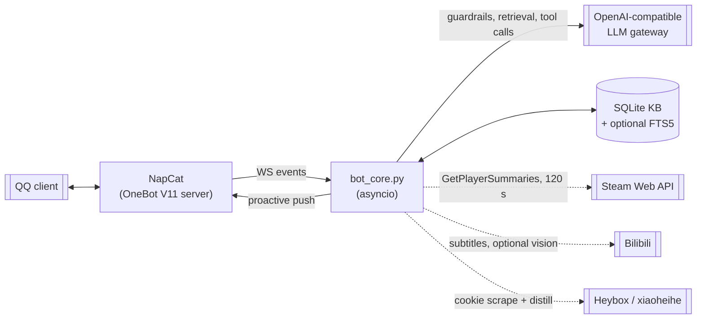

# SealClaw

An async QQ bot that connects over OneBot V11 reverse WebSocket, answers group and private messages through a tool-calling LLM, and keeps a local SQLite knowledge base fed by Steam, Bilibili and Heybox sensors.

Status: single-process, single-file prototype. The whole bot is `bot_core.py` (2,643 lines). All user-facing replies and prompts are written in Chinese.

## Features

Each feature is a phase (P0–P6) with its own offline test module.

- **P0 — WebSocket lifecycle.** Reverse-WS connect loop with exponential backoff (capped at 30 s), `open_timeout`/`ping_interval`/`ping_timeout` = 10/20/20 s, and a per-send lock so writes are serialized.
- **P1 — Event dispatch.** Handles `post_type == "message"` only. Text is read from `raw_message`, `message`, or a `message` segment list. Admin commands (whitelisted by QQ id, all others get a refusal): `/bind <qq> <steamid64>`, `/unbind <qq>`, `/autopush <qq> on|off`, `/group_sub <group> on|off`.
- **P2 — Tool-calling LLM.** Works against any OpenAI-compatible gateway. Six tools, up to 6 tool rounds per message, all calls made with `stream=true` and the deltas aggregated locally. A guardrail appends a `[来源: URL]` source line when the model used a retrieval tool but omitted citations.
- **P3 — Retrieval.** `search_verified` is knowledge-base-first against `kb_items` (only rows whose `expires_at` has not passed). On a miss it runs a DuckDuckGo search, fetches the top 3–6 pages, stores them with a per-source trust score and a `fact`/`tone` label, and returns the page text as evidence. A second retrieval tool, `search_gaming_info`, does a plain DuckDuckGo lookup. FTS5 is used for the KB when the SQLite build provides it, otherwise a `LIKE` fallback.
- **Dispute flag.** If two or more retrieved `fact` sources scoring >= 0.8 disagree on a version or date token, the tool result carries a dispute message; the reply is then prefixed with a dispute notice. This compares sources inside one result set by regex-extracted tokens — there is no embedding similarity and no cross-check of a cached answer against a live one.
- **P4 — User profiling.** Every message's keywords are stored in `chat_events` and merged into `user_profile.keyword_weights_json`: existing weights decay by 0.97 per update, tokens at or below 0.05 are dropped, new tokens start at 1, and the profile is capped at 80 tokens. Private chats get the top 8 keywords injected into the prompt.
- **P5 — Bilibili ingestion.** Given a BV id: fetch video metadata, then the player subtitles; 403/412 are caught and reported as `bilibili blocked` without raising. Only when `VISION_ENABLED=1` does it fall back to asking the LLM about the cover frame. Successful summaries are written to the KB as `media_type=video`.
- **P6 — Sensors and proactive push.** A Steam loop polls `GetPlayerSummaries` for every bound user (interval `STEAM_AUDIT_INTERVAL`, default 120 s, floored at 15 s), writes each poll to `steam_audit_events`, and pushes a private message on state change subject to `STEAM_AUDIT_PUSH_COOLDOWN` (default 600 s). A Heybox job scrapes pages with `HEYBOX_COOKIE` and distills hot words, slang and short sentence templates into a style hint injected as a second system message; it refreshes on a profile shift (12 h cooldown) or on `HEYBOX_FETCH_INTERVAL` (default 86400 s).
- **Tests.** 12 tests across 7 phase modules plus `conftest.py` fakes for the WebSocket, Steam and LLM clients. No network, no live game, no live LLM.

## Architecture



Four background asyncio tasks run alongside the receive loop: `steam_audit_loop`, `proactive_user_loop`, `proactive_group_loop`, and `connect_loop` (which blocks the main coroutine). Storage is one `sqlite3` connection guarded by an `asyncio.Lock`.

## Configuration

Read from the environment (see `.env.example`).

| Variable | Default | Purpose |
|---|---|---|
| `WS_URL` | `ws://host.docker.internal:3001` | NapCat OneBot reverse-WS endpoint |
| `OB11_ACCESS_TOKEN` | empty | Sent as `Authorization: Bearer` |
| `LLM_API_KEY` | empty | Required for chat replies |
| `LLM_BASE_URL` | empty | OpenAI-compatible gateway base URL |
| `LLM_MODEL` | `gpt-5.2` | Model id |
| `STEAM_API_KEY` | empty | Steam Web API key |
| `ADMIN_QQ_LIST` | empty | Comma-separated QQ ids allowed to run `/` commands |
| `VISION_ENABLED` | `0` | Enables the Bilibili cover-frame fallback |
| `HEYBOX_COOKIE` | empty | Required for Heybox scraping |
| `HEYBOX_STYLE_ENABLED` | `1` | Master switch for style injection |
| `HEYBOX_FETCH_INTERVAL` | `86400` | Seconds between Heybox refreshes |
| `STEAM_AUDIT_INTERVAL` | `120` | Steam poll interval, floored at 15 s |
| `STEAM_AUDIT_PUSH_COOLDOWN` | `600` | Seconds between Steam pushes per user |
| `PROACTIVE_INTERVAL_USER` / `PROACTIVE_INTERVAL_GROUP` | `1800` / `3600` | Proactive push intervals |
| `HTTP_PROXY` / `HTTPS_PROXY` | empty | Proxy for Steam and DuckDuckGo |
| `DB_PATH` | `data/bot.db` | SQLite file |
| `LOG_LEVEL` | `INFO` | Log level |

`LLM_API_KEY` is the only key required for chat. With it absent the bot still runs its command handler, KB search and Steam pushes; it returns a fixed "LLM not configured" message instead of a generated reply (the stub text is Chinese).

## Getting started

```bash
git clone https://github.com/Seal-Re/SealClaw.git && cd SealClaw

cp .env.example .env
$EDITOR .env                      # set LLM_API_KEY, and WS_URL to reach NapCat

# Native
pip install -r requirements.txt
python bot_core.py

# Or Docker Compose (expects NapCat reachable at host.docker.internal:3001)
docker compose up -d --build

# Offline tests
pytest -q
```

The compose file mounts `./data` into the container and sets `host.docker.internal:host-gateway`.

## Project layout

```
SealClaw/
├── bot_core.py                      # the entire bot
├── requirements.txt                 # aiohttp, duckduckgo-search, openai, websockets, pytest
├── docker-compose.yml
├── Dockerfile                       # python:3.11-slim, runs bot_core.py
├── .env.example
├── docs/bot_core_audit_P0-P6.md     # per-phase audit of the same code
├── tests/                           # conftest.py + one module per phase
└── data/bot.db                      # SQLite database
```

## Limitations

- `bot_core.py` is a single file; the roadmap item to split it into packages is not done.
- Only `message` events are handled. `notice`, `request` and `meta_event` posts are ignored.
- `proactive_user_loop` and `proactive_group_loop` call the synchronous `duckduckgo_search` client, which blocks the event loop while it runs.
- `steam_audit_events` grows without bound; there is no pruning or archival.
- SQLite runs without WAL, so multiple processes sharing the file would contend on writes.
- The scheduled disclaimers in the roadmap (PostgreSQL/Qdrant, plugin system) are not implemented.

## License

MIT. See `LICENSE`.
